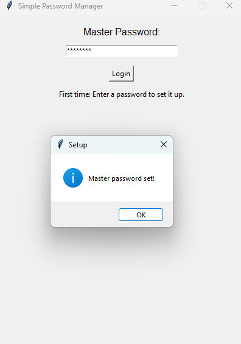
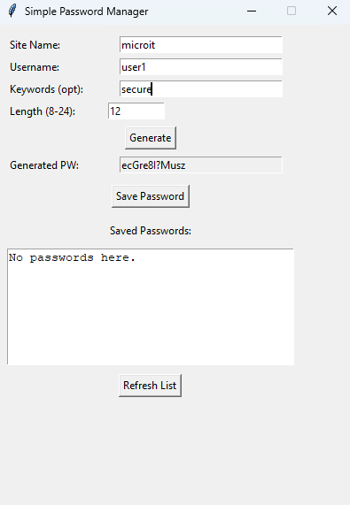
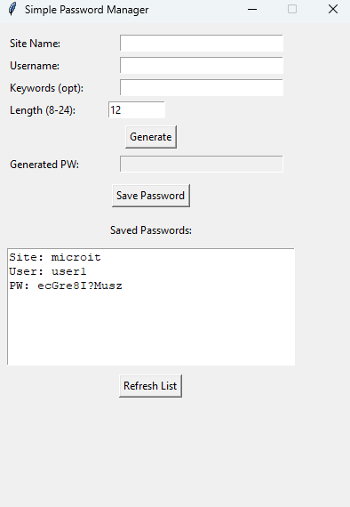

Secure Password Manager (and Generator)
A simple, secure, and user-friendly desktop application built with Python and Tkinter for generating strong passwords and securely storing them. This tool helps you create unique, complex passwords for all your online accounts and manage them easily.

Features
Strong Password Generation: Generates robust passwords with a mix of uppercase and lowercase letters, numbers, and special characters. You can also include custom keywords for added personalization and strength.
Encrypted Storage: Securely saves your website, username, and generated passwords using encryption. Your data is protected by a master password, ensuring only you can access it.
Intuitive GUI: A simple graphical user interface (GUI) built with Tkinter makes it easy to generate, save, and view your passwords.
First-Time Setup: Guides you through setting up your master password for the first time, which then acts as your key to decrypt and access your stored credentials.
Screenshots
Here's a quick look at the application in action:

Login Screen
This is the first screen you'll see, where you enter your master password or set it up for the first time.

Main Application - Generate and Save
After logging in, you can generate new passwords and save them.

Main Application - View Saved Passwords
See all your securely stored credentials.

Getting Started
Follow these instructions to get a copy of the project up and running on your local machine.

Prerequisites
You'll need Python 3.x installed on your system.

This project also uses the cryptography library for encryption. You can install it using pip:

Bash

pip install cryptography
Installation
Clone the repository:

Bash

git clone https://github.com/your-username/your-repo-name.git
cd your-repo-name
(Replace your-username/your-repo-name.git with your actual GitHub repository URL.)

Run the application:

Bash

python secure_password_manager.py
(If you renamed the file, use your new filename, e.g., python password_tool.py)

Usage
First-Time Login:

When you run the application for the first time, you'll be prompted to create a master password. Choose a strong, memorable password, as this will be the only password you need to remember to access all your stored credentials.
This master password is used to encrypt your saved data and is never stored directly. Instead, a secure key is derived from it.
Subsequent Logins:

Each time you open the application, you'll need to enter your master password to decrypt and access your saved passwords.
Generating a Password:

Enter the Website name (e.g., "Google", "Facebook").
Enter your Username for that website.
Optionally, enter Keywords (e.g., "mycat", "travel2025") that you want to include in the password. Separate multiple keywords with spaces.
Specify the desired password length (recommended: 8-32 characters).
Click "Generate Password". The new password will appear in the "Generated Password" field.
Saving a Password:

After generating a password, ensure the Website, Username, and Generated Password fields are filled.
Click "Save Password" to encrypt and store the credentials.
Viewing Saved Passwords:

The "Saved Passwords" section will automatically display your decrypted entries after a successful login.
Click "Refresh List" if you've recently saved new passwords and want to update the display.
Security Notes (Important!)
This tool demonstrates basic encryption principles for local password management. While it uses cryptography.fernet and a key derived from your master password using a secure method like PBKDF2HMAC (in the more advanced version), it's important to understand the following:

Master Password is Crucial: The security of your stored passwords depends entirely on the strength of your master password. Choose a strong, unique one and never share it. If you forget it, your encrypted data cannot be recovered.
Local Storage: Your encrypted passwords are saved on your local machine. This tool does not use cloud storage or sync across devices.
No Advanced Security Features: This is a simplified educational project and does not include advanced features found in commercial password managers, such as:
Advanced brute-force protection beyond basic KDF iterations.
Detailed logging of access attempts.
Automatic clipboard clearing after copying.
Multi-factor authentication.
Secure password sharing or recovery mechanisms.
For high-stakes, production-level security, consider using established and audited commercial password managers. This project serves as a great learning tool for understanding how basic encryption and password management can be implemented in Python.

Contributing
Contributions are welcome! If you have suggestions for improvements, bug fixes, or new features, feel free to:

Fork the repository.
Create your feature branch (git checkout -b feature/AmazingFeature).
Commit your changes (git commit -m 'Add some AmazingFeature').
Push to the branch (git push origin feature/AmazingFeature).
Open a Pull Request.
License
Distributed under the MIT License. See LICENSE for more information.
